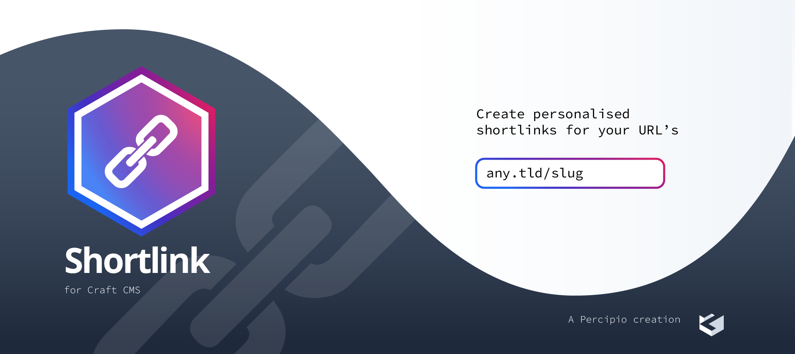

# craft-shortlink plugin for Craft CMS 3.x

A plugin to generate editable short urls from entries

 

## Requirements

This plugin requires Craft CMS 4.0.0 or later.

## Installation

To install the plugin, follow these instructions.

1. Open your terminal and go to your Craft project:

        cd /path/to/project

2. Then tell Composer to load the plugin:

        composer require https://github.com/percipioglobal/craft-shortlink

3. In the Control Panel, go to Settings → Plugins and click the “Install” button for craft-shortlink.

## craft-shortlink Overview

Currently in beta, do not use in production environments

Brought to you by [Percipio](https://percipio.london)
